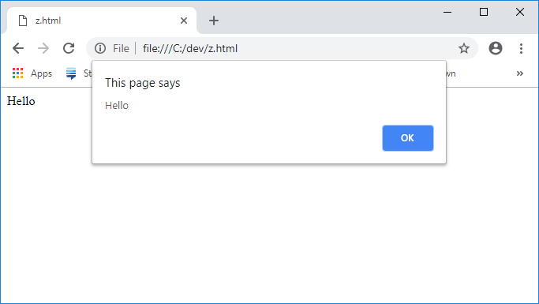

# ТЕХНІЧНЕ ЗАВДАННЯ

Потрібно зробити примітивний калькулятор в якому є 2 інпути куди моожна ввести число, випадаючий список де можна вибрати дію яку ти хочеш зробити ( додавання, віднімання, множення, ділення ) і кнопочка дорівнює. Коли нажимаєш на кнопку дорівнює повинно появлятись повідомлення(Приклад 1),в якій буде відповідь у такому форматі: "Відповідь: 435".

---

# ВИМОГИ

- Щоб на кожну дію була своя функція яка повертає результат дії ( додавання, віднімання, множення, ділення );
- Потрібна головна функція яка не буде повертати результат, а тільки викликати метод повідомлення (В ній повинна описуватись логіка вибору дії);
- Зрозумілий неймінг функцій і змінних;
- Використовувати встроєний метод для повідомленнь.

---

# ЗА БАЖАННЯМ

- Стилізація сторінки (Файл для стилів створенно але можна не стилізувати);

---

# ЗАБОРОНЕНО

- Генерувати код через ШІ ( Дозволяється запитувати в нього все що завгодно але не генерувати код саме для завдання)
- Брати з гугла повністю готові роботи ( Дозволяється шукати інформацію, брати якісь приклади але не просто копіпаст)

---

## P.S. Якщо будуть питання звертатись в особисті повідомлення.

---

### Приклад 1

 

